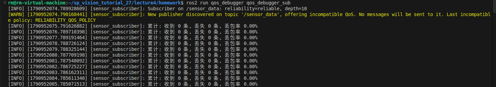
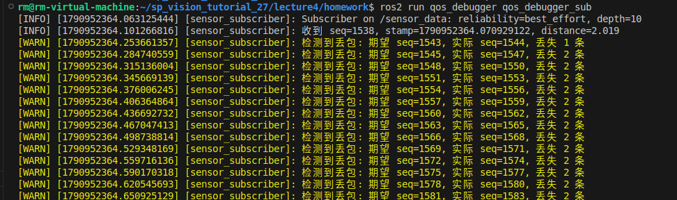
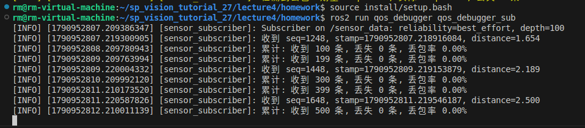
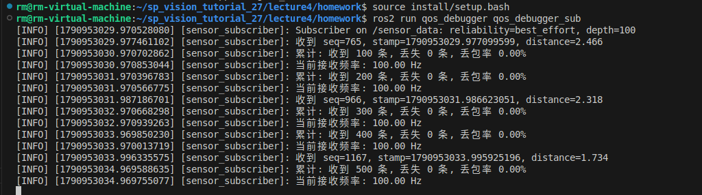

# nav_lecture4小作业：Qos_debugger
这道题的目标就是让你快速上手、理解什么是ros。抛开复杂的概念，ros本质上完成的任务就是便利的进程间通信。比如，我有两个进程，一个进程发布雷达数据，另一个进程接收。使用ros就可以方便的完成通讯。你可以搜索以下，发送信息有哪些类型，分别有何特点。特别注意，不同的信息传输方式有不同的质量要求。你不会允许送的外卖没到你手上，但是一个电话过来，也许漏接了也无所谓，可能只是个诈骗。ros2也是这样。重点关注这一点会对这道题有所帮助

> 环境要求：ROS2 Humble

## 包结构

```
src/
  nav_hw_interfaces/     # 接口包：只放 .msg，无业务代码
    msg/SensorData.msg   # 可以打开.msg文件查看接口详细内容
  qos_debugger/          # 业务节点包
    src/qos_debugger_pub.cpp   # 发布 /SensorData
    src/qos_debugger_sub.cpp   # 订阅 /SensorData
```

## 编译

```bash
cd lecture4/homework
colcon build 
source install/setup.bash
```


## 任务一：实现pub和sub的通信

```bash
ros2 -h     //有忘记的命令就输入-h去查询用法
```

**现象**：启动pub和sub节点后sub节点订阅不到任何消息
提示：如果两个节点不能通过话题通信，我们应该如何区查看话题的详细信息（有没有相关的命令）
任务一仅修复qos_debugger_pub.cpp的一处或几处代码即可完成

---

## 任务二：为什么收到的消息会丢包？/(ㄒoㄒ)/~~

第一问找到问题并修改代码后，记得重新
```colcon build```
```source install/setup.bash```
**现象**：sub会打印黄色的warning输出告诉你丢包的序列，每秒还会打印出丢包率

提示：
有没有什么命令可以查看节点的配置(ros2 param -h)
可以通过修复qos_debugger_sub.cpp中的一处或几处代码解决该问题（可能会有多种解决方法）


## 任务三：把收到的消息的帧率计算并打印出来（放在定时器回调函数中每秒打印一次即可）
补全qos_debugger_sub.cpp即可


在下面按顺序完成三个任务，要求把用到的命令放入代码块中并讲解命令，每一问最好加入自己的理解

1.

我将sub.cpp第20行的reliable改成了best_effort。

在排查收不到消息的问题时，我意识到 ROS2 的 QoS 机制非常严格。通过 ros2 topic info -v 查看后，我将订阅者的 reliability 策略修改为 best_effort 保持两端一致，通信立马就恢复了。这让我深刻理解了QoS的重要性。

2.
错误图像在任务一第二张图中已给出
我把sub.cpp第21行的深度放大为100，并将22行的默认延迟改为0。根据ai提示，还将86-90行的sleep逻辑注释掉了

丢包是因为‘生产太快，消费太慢’，并且队列太浅。发布者每秒发 100 条，但订阅者每条都要 sleep 30 毫秒，并且队列只能存 10 条。通过加大 depth 并取消回调中的 sleep，丢包率降到了 0%。也可以用过 ros2 param get /sensor_subscriber depth 查看当前参数配置。

3.
uint32_t current_received = received_count_;
uint32_t delta_count = current_received - last_received_count_;
double frequency = static_cast<double>(delta_count);

RCLCPP_INFO(this->get_logger(), "当前接收频率: %.2f Hz", frequency);

last_received_count_ = current_received; 
频率计算利用了定时器每秒触发一次 report() 的特性。我只需要用当前总接收数减去上一秒记录的数量，就能得到这一秒的增量，即频率。这让我学会了如何用 ROS2 的 create_wall_timer 来进行周期性的数据统计。


------